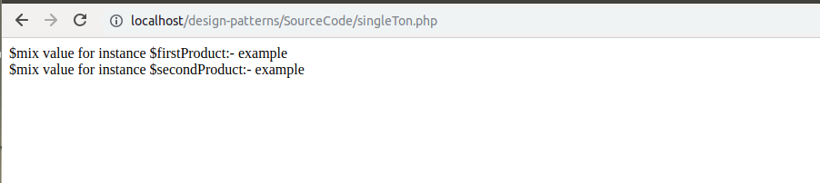

# SingleTon
It is like a single resource which is being shared among multiple users; for example - sharing a single refrigerator or kitchen among all the members of a flat in any hotel.
```
The singleton pattern is a software design pattern that restricts the instantiation of a class to one object
```
We can say singleton pattern ensures that single instance of a class is created and shared among all other objects in an application.
```
<?php
/**
 * Singleton class
 */
final class Product
{
    /** 
     * @var self 
     */
    private static $instance;
    /**
     * @var mixed
     */
    public $mix;
    /**
     * Return self instance
     * @return self
     */
    public static function getInstance() {
        if (! (self::$instance instanceof self)) {
            self::$instance = new self();
        }
        return self::$instance;
    }
    private function __construct() {
    }
    private function __clone() {
    }
}
$firstProduct = Product::getInstance();
$secondProduct = Product::getInstance();
// Initializing $mix value for first instance
$firstProduct->mix = 'test';
// Initializing $mix value for the second instance
$secondProduct->mix = 'example';
echo '$mix value for instance $firstProduct:- '.$firstProduct->mix."<br/>";
echo '$mix value for instance $secondProduct:- '.$secondProduct->mix."<br/>";
?>
```
Following will be the output of the above example:-
<br/>

<br/>
<div>	
  <span><a href ="https://github.com/satish-dev/design-patterns/blob/master/Documentation/Introduction.md" >Next (Design Patterns)</a></span>
	&nbsp;&nbsp;&nbsp;&nbsp;&nbsp;&nbsp;&nbsp;&nbsp;&nbsp;&nbsp;&nbsp;&nbsp;&nbsp;
	&nbsp;&nbsp;&nbsp;&nbsp;&nbsp;&nbsp;&nbsp;&nbsp;&nbsp;&nbsp;&nbsp;&nbsp;&nbsp;
	&nbsp;&nbsp;&nbsp;&nbsp;&nbsp;&nbsp;&nbsp;&nbsp;&nbsp;&nbsp;&nbsp;&nbsp;&nbsp;
	&nbsp;&nbsp;&nbsp;&nbsp;&nbsp;&nbsp;&nbsp;&nbsp;&nbsp;&nbsp;&nbsp;&nbsp;&nbsp;
    &nbsp;&nbsp;&nbsp;&nbsp;&nbsp;&nbsp;&nbsp;&nbsp;&nbsp;&nbsp;&nbsp;&nbsp;&nbsp;
	&nbsp;&nbsp;&nbsp;&nbsp;&nbsp;&nbsp;&nbsp;&nbsp;&nbsp;&nbsp;&nbsp;&nbsp;&nbsp;
	&nbsp;&nbsp;&nbsp;&nbsp;&nbsp;&nbsp;&nbsp;&nbsp;&nbsp;&nbsp;&nbsp;&nbsp;&nbsp;
	&nbsp;&nbsp;
	<span><a href ="https://github.com/satish-dev/design-patterns/blob/master/documentation/Multiton.md" >Next (Multiton)</a> </span>
</div>