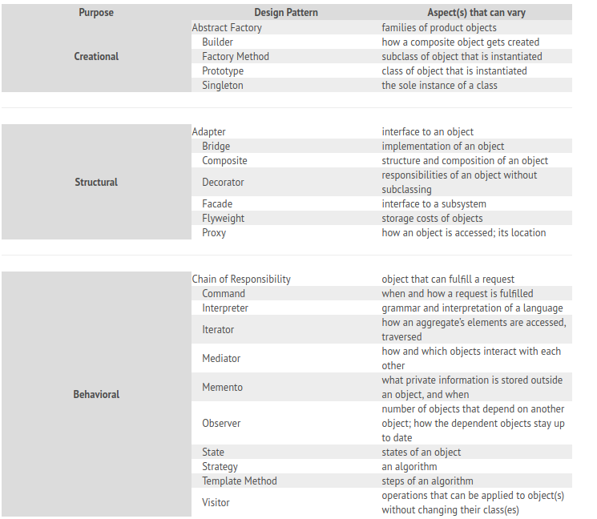

# Design Patterns
Design patterns is **description of comunicating objects and classes that are cutomized to solve a general design problem in a particular context**.
Design patterns provide a way to re-use solution to the programming problems that we en-counter every day.
## Design patterns can be categorized into the following:
* *Creational Patterns*:- These are used to construct object such that they can be de-coupled from their implementing system.
* *Structural Patterns*:- These are used to form larage object structures between many different objects.
* *Behavioral Patterns*:- These are used to manage algorithms, relationships, and responsibilites between objects.
Following are the desing patterns are available :-

	
  <a href ="https://github.com/satish-dev/design-patterns/blob/master/README.md" >Previous (Read Me)</a>
	&nbsp;&nbsp;&nbsp;&nbsp;&nbsp;&nbsp;&nbsp;&nbsp;&nbsp;&nbsp;&nbsp;&nbsp;&nbsp;
	&nbsp;&nbsp;&nbsp;&nbsp;&nbsp;&nbsp;&nbsp;&nbsp;&nbsp;&nbsp;&nbsp;&nbsp;&nbsp;
	&nbsp;&nbsp;&nbsp;&nbsp;&nbsp;&nbsp;&nbsp;&nbsp;&nbsp;&nbsp;&nbsp;&nbsp;&nbsp;
	&nbsp;&nbsp;&nbsp;&nbsp;&nbsp;&nbsp;&nbsp;&nbsp;&nbsp;&nbsp;&nbsp;&nbsp;&nbsp;
    &nbsp;&nbsp;&nbsp;&nbsp;&nbsp;&nbsp;&nbsp;&nbsp;&nbsp;&nbsp;&nbsp;&nbsp;&nbsp;
	&nbsp;&nbsp;&nbsp;&nbsp;&nbsp;&nbsp;&nbsp;&nbsp;&nbsp;&nbsp;&nbsp;&nbsp;&nbsp;
	&nbsp;&nbsp;&nbsp;&nbsp;&nbsp;&nbsp;&nbsp;&nbsp;&nbsp;&nbsp;&nbsp;&nbsp;&nbsp;
	&nbsp;&nbsp;
	<a href ="https://github.com/satish-dev/design-patterns/blob/master/documentation/Singleton.md" >Next (Singleton)</a> 

