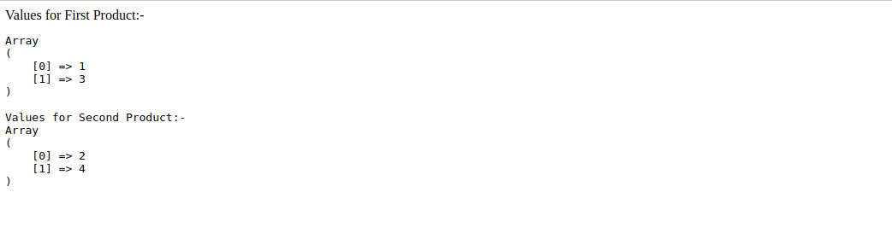

# SingleTon
It is like a single resource which is being shared among multiple users; for example - sharing a single refrigerator or kitchen among all the members of a flat in any hotel.
```
The singleton pattern is a software design pattern that restricts the instantiation of a class to one object
```
We can say singleton pattern ensures that single instance of a class is created and shared among all other objects in an application.
```
<?php
/**
 * Singleton class
 */
final class Product
{
    /** 
     * @var self 
     */
    private static $instance;
    /**
     * @var mixed
     */
    public $mix;
    /**
     * Return self instance
     * @return self
     */
    public static function getInstance() {
        if (! (self::$instance instanceof self)) {
            self::$instance = new self();
        }
        return self::$instance;
    }
    private function __construct() {
    }
    private function __clone() {
    }
}
$firstProduct = Product::getInstance();
$secondProduct = Product::getInstance();
// Initializing $mix value for first instance
$firstProduct->mix = 'test';
// Initializing $mix value for the second instance
$secondProduct->mix = 'example';
echo '$mix value for instance $firstProduct:- '.$firstProduct->mix."<br/>";
echo '$mix value for instance $secondProduct:- '.$secondProduct->mix."<br/>";
?>
```
Following will be the output of the above example:-
<br/>

<br/>
**Note** :- *The main trick here is that we have made the constructor private which is what disallows creation of multiple instances of singleton class*.
# Multiton Pattern 
As the name suggests, a multiton is a design pattern that helps you create multiple instances of itself. Both singleton and multiton are same, the only difference is that a multiton can store and retrieve multiple instances of itself.
```
abstract class FactoryAbstract 
{
    protected static $instances = array();
    public static function getInstance() 
    {
        $className = static::getClassName();
        if (!(self::$instances[$className] instanceof $className)) {
            self::$instances[$className] = new $className();
        }
        return self::$instances[$className];
    }
    public static function removeInstance()
    {
        $className = static::getClassName();
        if (array_key_exists($className, self::$instances)) {
            unset(self::$instances[$className]);
        }
    }
    final protected static function getClassName()
    {
        return get_called_class();
    }
    protected function __construct() { }
    final protected function __clone() { }
}
// using:
class FirstProduct extends FactoryAbstract {
    public $a = [];
}
class SecondProduct extends FirstProduct {
}
FirstProduct::getInstance()->a[] = 1;
SecondProduct::getInstance()->a[] = 2;
FirstProduct::getInstance()->a[] = 3;
SecondProduct::getInstance()->a[] = 4;
echo "Values for First Product:-<br/><pre>";
print_r(FirstProduct::getInstance()->a);
echo "<br/>Values for Second Product:-<br/>";
// array(1, 3)
print_r(SecondProduct::getInstance()->a);
// array(2, 4)
```
Following will be the output of the above example:-
<br/>

<br/>
*Note: It will create the instance of the class equal to the number of inheritance of the class*
**Single ton and multiton comes under the Creational patterns**
<div>	
  <span><a href ="https://github.com/satish-dev/design-patterns/blob/master/documentation/Introduction.md" >Previous (Design Patterns)</a></span>
	&nbsp;&nbsp;&nbsp;&nbsp;&nbsp;&nbsp;&nbsp;&nbsp;&nbsp;&nbsp;&nbsp;&nbsp;&nbsp;
	&nbsp;&nbsp;&nbsp;&nbsp;&nbsp;&nbsp;&nbsp;&nbsp;&nbsp;&nbsp;&nbsp;&nbsp;&nbsp;
	&nbsp;&nbsp;&nbsp;&nbsp;&nbsp;&nbsp;&nbsp;&nbsp;&nbsp;&nbsp;&nbsp;&nbsp;&nbsp;
	&nbsp;&nbsp;&nbsp;&nbsp;&nbsp;&nbsp;&nbsp;&nbsp;&nbsp;&nbsp;&nbsp;&nbsp;&nbsp;
    &nbsp;&nbsp;&nbsp;&nbsp;&nbsp;&nbsp;&nbsp;&nbsp;&nbsp;&nbsp;&nbsp;&nbsp;&nbsp;
	&nbsp;&nbsp;&nbsp;&nbsp;&nbsp;&nbsp;&nbsp;&nbsp;&nbsp;&nbsp;&nbsp;&nbsp;&nbsp;
	&nbsp;&nbsp;&nbsp;&nbsp;&nbsp;&nbsp;&nbsp;&nbsp;&nbsp;&nbsp;&nbsp;&nbsp;&nbsp;
	&nbsp;&nbsp;
	<span><a href ="https://github.com/satish-dev/design-patterns/blob/master/documentation/StrategyDecorator.md" >Next (Strategy & Decorator) 
</div>