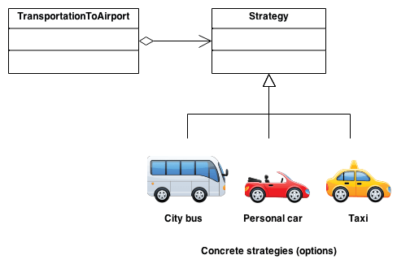
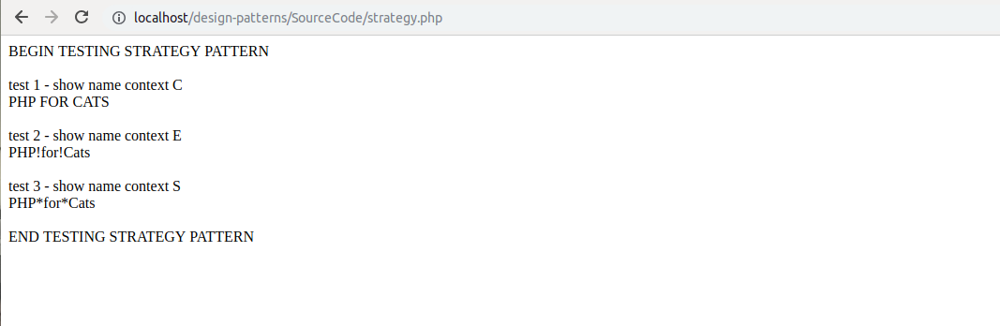
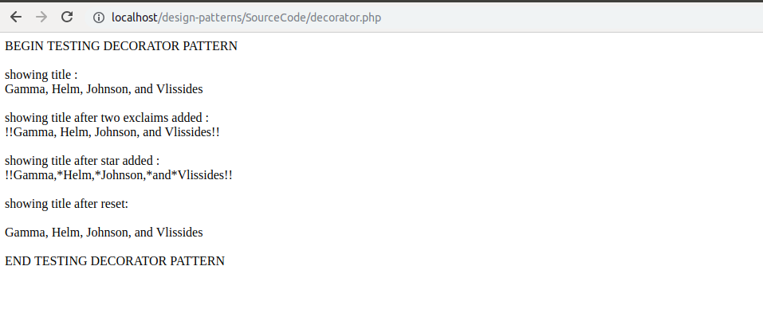

# Strategy & Decorator Patterns
## Strategy
* *Define a family of algorithms, encapsulate each one, and make them interchangeable. Strategy lets the algorithm vary independently from the clients that use it*
* *Capture the absraction in an interface, bury implementation details in derived classes.*
Below image will let you know about the idea of strategy design pattern
<br/>

```
<?php
class StrategyContext
{
    private $strategy = null;
    public function __construct($strategy_ind_id)
    {
        switch ($strategy_ind_id) {
            case "C":
                $this->strategy = new StrategyCaps();
                break;
            case "E":
                $this->strategy = new StrategyExclaim();
                break;
            case "S":
                $this->strategy = new StrategyStars();
                break;
            default:
                break;
        }
    }
    public function showBookTitle($book)
    {
        return $this->strategy->showTitle($book);
    }
}
interface StrategyInterface
{
    public function showTitle($book_in);
}
class StrategyCaps implements StrategyInterface
{
    public function showTitle($book_in)
    {
        $title = $book_in->getTitle();
        $this->titleCount++;
        return strtoupper($title);
    }
}
class StrategyExclaim implements StrategyInterface
{
    public function showTitle($book_in)
    {
        $title = $book_in->getTitle();
        $this->titleCount++;
        return Str_replace(' ', '!', $title);
    }
}
class StrategyStars implements StrategyInterface
{
    public function showTitle($book_in)
    {
        $title = $book_in->getTitle();
        $this->titleCount++;
        return Str_replace(' ', '*', $title);
    }
}
class Book
{
    private $author;
    private $title;
    public function __construct($title_in, $author_in)
    {
        $this->author = $author_in;
        $this->title = $title_in;
    }
    public function getAuthor()
    {
        return $this->author;
    }
    public function getTitle()
    {
        return $this->title;
    }
    public function getAuthorAndTitle()
    {
        return $this->getTitle() . ' by ' . $this->getAuthor();
    }
}
writeln('BEGIN TESTING STRATEGY PATTERN');
writeln('');

$book = new Book('PHP for Cats', 'Larry Truett');

$strategyContextC = new StrategyContext('C');
$strategyContextE = new StrategyContext('E');
$strategyContextS = new StrategyContext('S');

writeln('test 1 - show name context C');
writeln($strategyContextC->showBookTitle($book));
writeln('');

writeln('test 2 - show name context E');
writeln($strategyContextE->showBookTitle($book));
writeln('');

writeln('test 3 - show name context S');
writeln($strategyContextS->showBookTitle($book));
writeln('');

writeln('END TESTING STRATEGY PATTERN');

function writeln($line_in)
{
    echo $line_in . "<br/>";
}
```
Above code will generate the following output:-
<br/>

<br/>
## Decorator
* Attach additional responsibilities to an object dynamically. Decorators provide a flexible alternative to subclassing for extending functionality.
* Client-specified embellishment of a core object by recursively wrapping it.
* Wrapping a gift, putting it in a box, and wrapping the box.
*Example of decorator*
```
<?php
require_once 'error_reporting.php';
class Book
{
    private $author;
    private $title;
    public function __construct($title_in, $author_in)
    {
        $this->author = $author_in;
        $this->title = $title_in;
    }
    public function getAuthor()
    {
        return $this->author;
    }
    public function getTitle()
    {
        return $this->title;
    }
    public function getAuthorAndTitle()
    {
        return $this->getTitle() . ' by ' . $this->getAuthor();
    }
}

class BookTitleDecorator
{
    protected $book;
    protected $title;
    public function __construct(Book $book_in)
    {
        $this->book = $book_in;
        $this->resetTitle();
    }
    //doing this so original object is not altered
    public function resetTitle()
    {
        $this->title = $this->book->getTitle();
    }
    public function showTitle()
    {
        return $this->title;
    }
}

class BookTitleExclaimDecorator extends BookTitleDecorator
{
    private $btd;
    public function __construct(BookTitleDecorator $btd_in)
    {
        $this->btd = $btd_in;
    }
    public function exclaimTitle()
    {
        $this->btd->title = "!" . $this->btd->title . "!";
    }
}

class BookTitleStarDecorator extends BookTitleDecorator
{
    private $btd;
    public function __construct(BookTitleDecorator $btd_in)
    {
        $this->btd = $btd_in;
    }
    public function starTitle()
    {
        $this->btd->title = Str_replace(" ", "*", $this->btd->title);
    }
}

writeln('BEGIN TESTING DECORATOR PATTERN');
writeln('');

$patternBook = new Book('Gamma, Helm, Johnson, and Vlissides', 'Design Patterns');

$decorator = new BookTitleDecorator($patternBook);
$starDecorator = new BookTitleStarDecorator($decorator);
$exclaimDecorator = new BookTitleExclaimDecorator($decorator);

writeln('showing title : ');
writeln($decorator->showTitle());
writeln('');

writeln('showing title after two exclaims added : ');
$exclaimDecorator->exclaimTitle();
$exclaimDecorator->exclaimTitle();
writeln($decorator->showTitle());
writeln('');

writeln('showing title after star added : ');
$starDecorator->starTitle();
writeln($decorator->showTitle());
writeln('');

writeln('showing title after reset: ');
writeln($decorator->resetTitle());
writeln($decorator->showTitle());
writeln('');

writeln('END TESTING DECORATOR PATTERN');

function writeln($line_in)
{
    echo $line_in . "<br/>";
}
```
Following will be the output of the above example :-
<br/>

<br/>
<div>	
  <span><a href ="https://github.com/satish-dev/design-patterns/blob/master/documentation/Singleton.md" >Previous (Single and Multiton)</a></span>
	&nbsp;&nbsp;&nbsp;&nbsp;&nbsp;&nbsp;&nbsp;&nbsp;&nbsp;&nbsp;&nbsp;&nbsp;&nbsp;
	&nbsp;&nbsp;&nbsp;&nbsp;&nbsp;&nbsp;&nbsp;&nbsp;&nbsp;&nbsp;&nbsp;&nbsp;&nbsp;
	&nbsp;&nbsp;&nbsp;&nbsp;&nbsp;&nbsp;&nbsp;&nbsp;&nbsp;&nbsp;&nbsp;&nbsp;&nbsp;
	&nbsp;&nbsp;&nbsp;&nbsp;&nbsp;&nbsp;&nbsp;&nbsp;&nbsp;&nbsp;&nbsp;&nbsp;&nbsp;
    &nbsp;&nbsp;&nbsp;&nbsp;&nbsp;&nbsp;&nbsp;&nbsp;&nbsp;&nbsp;&nbsp;&nbsp;&nbsp;
	&nbsp;&nbsp;&nbsp;&nbsp;&nbsp;&nbsp;&nbsp;&nbsp;&nbsp;&nbsp;&nbsp;&nbsp;&nbsp;
	&nbsp;&nbsp;&nbsp;&nbsp;&nbsp;&nbsp;&nbsp;&nbsp;&nbsp;&nbsp;&nbsp;&nbsp;&nbsp;
	&nbsp;&nbsp;
	<span><a href ="https://github.com/satish-dev/design-patterns/blob/master/documentation/RegistryFactory.md" >Next (Registry and Factory) 
</div>
